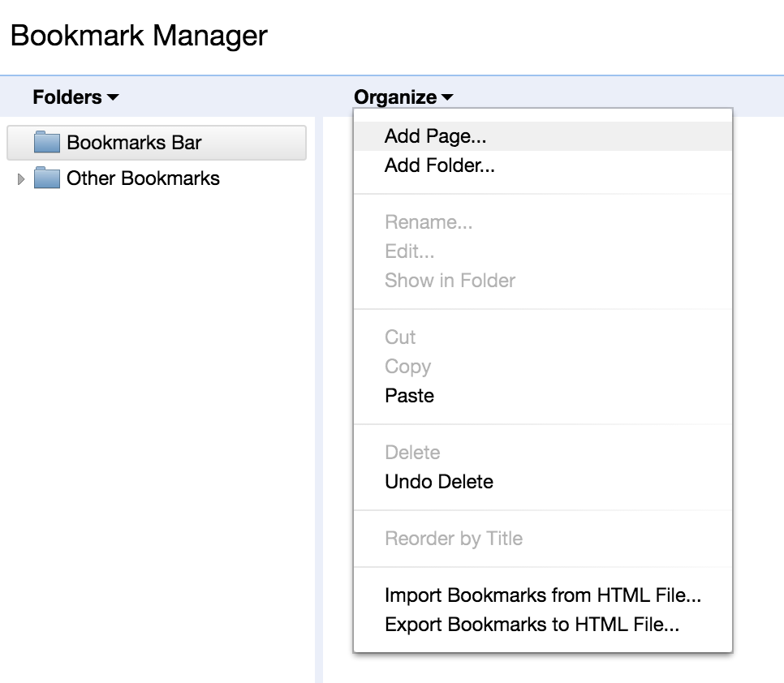
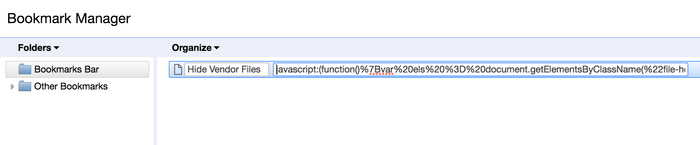

# Hide iOS Carthage Files from Github Pull Requests

Forked.  [Nosajool/github-pr-hide-go-vendor-files](https://github.com/Nosajool/github-pr-hide-go-vendor-files)

# Installation


Create a new bookmark using the following single line encoded javascript snippet:

```
javascript:(function()%7Bvar%20els%20%3D%20document.getElementsByClassName(%22file-header%22)%3BArray.prototype.forEach.call(els%2C%20function(el)%7Bif(el.getAttribute('data-path').indexOf('Carthage%2F')%20!%3D%3D%20-1)%7Bel.parentElement.style.display%20%3D%20%22none%22%3B%7D%7D)%7D)()
```

1. In chrome click Bookmarks->Bookmark Manager.
2. Click the "Organize" link, then "Add Page" in the drop down.
3. Paste the snippet in the url text box (second one)





# Usage

When reviewing the "Files changed" tab on Github, click on the bookmark. Voila! Vendor files are gone!
